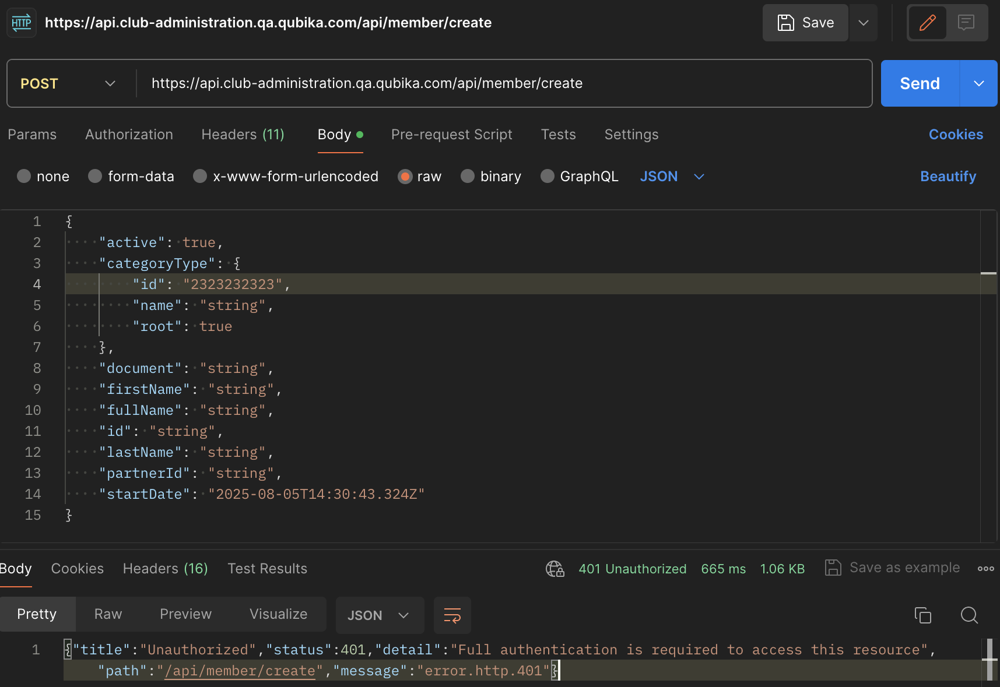
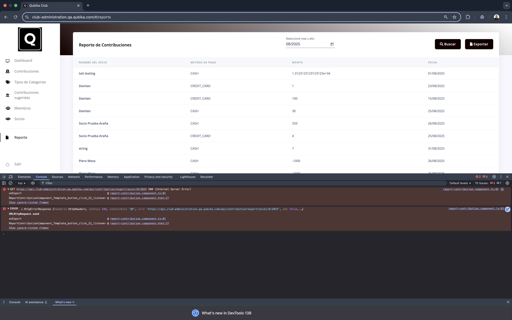
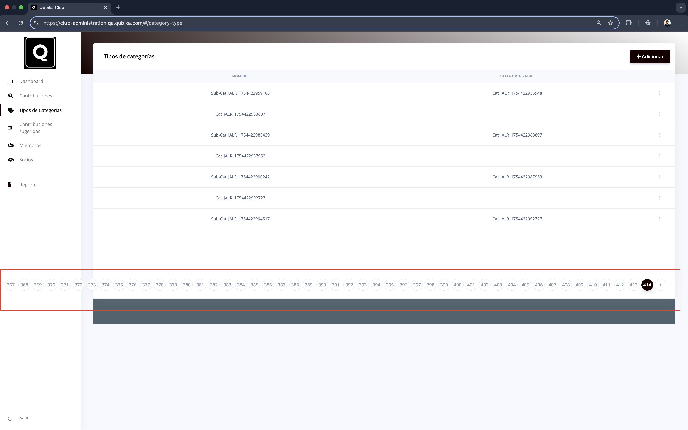
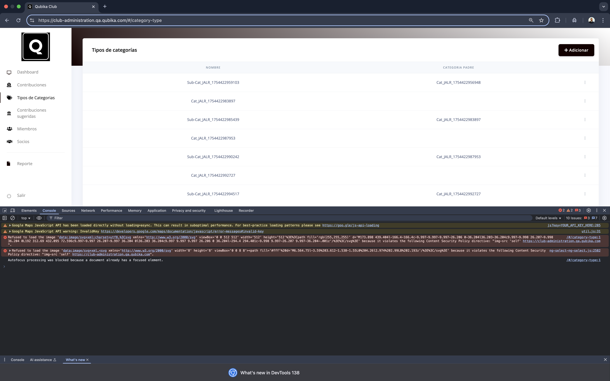

# Exploratory Testing Report - Qubika Sports Club Management

This report details the issues and suggestions for improvement identified during the exploratory testing phase of the **Qubika Sports Club Management** project. The testing was conducted with a focus on UI, UX, styles, API, and security aspects, aiming to ensure the system's optimal condition.

## Identified Issues and Observations

### API Observations

**Issue: Unauthorized Access to User Creation Endpoints**

Description: Attempts to create new users or members via the API (specifically POST /api/auth/register and POST /api/member/create) consistently resulted in a 401 Unauthorized error. This occurred even when attempting to use the provided test user's credentials for authentication.

Error: 
~~~
{
    "title": "Unauthorized",
    "status": 401,
    "detail": "Full authentication is required to access this resource",
    "path": "/api/member/create",
    "message": "error.http.401"
}
~~~

Context: This issue was observed both during automated test execution (where the API user creation step was intended) and manual testing using tools like Postman.

Impact: Prevents the programmatic creation of new users/members, which could hinder automated testing scenarios requiring unique user setups or integration with external systems.

Severity: **High** (Blocks a core API functionality for user/member management).

Evidence:

### UI Observations

1. Issue: Export Action Fails in Reports Section

Description: In the "Reportes" (Reports) section, after filtering data by a specific month (e.g., August 2025) and then clicking the "Export" button, no action is performed. The application does not download a file, display an error, or provide any feedback to the user.

Technical Details: The browser console shows a GET request to https://api.club-administration.qa.qubika.com/api/contribution/export/excel/8/2025 returning a 500 (Internal Server Error). This indicates a server-side issue during the report generation or export process.

Impact: Prevents users from exporting critical report data, hindering data analysis and record-keeping.

Severity: **High** (Blocks a key functional feature).

Technical Details: The browser console shows a GET request to https://api.club-administration.qa.qubika.com/api/contribution/export/excel/8/2025 returning a 500 (Internal Server Error). This indicates a server-side issue during the report generation or export process.

~~~
HttpErrorResponse {headers: HttpHeaders, status: 500, statusText: 'OK', url: 'https://api.club-administration.qa.qubika.com/api/contribution/export/excel/8/2025', ok: false, …}

message: "Http failure response for https://api.club-administration.qa.qubika.com/api/contribution/export/excel/8/2025: 500 OK"
name:"HttpErrorResponse"
ok: false
status:500
~~~

2. **Issue:Pagination Overlaps Content and Breaks Layout**

Description: On the "Tipos de categorías" (Category Types) page, when the number of categories exceeds the display limit, the pagination controls appear. However, these controls are rendered out of context, overlapping with the table content and extending horizontally beyond the visible screen area, requiring horizontal scrolling to view all page numbers.     * Context: This issue was observed when navigating to the "Categorías" section and viewing the list of categories, particularly when the list was long enough to trigger pagination.

Impact: Significantly degrades the user experience by making the pagination controls difficult to use and obscuring table data. It indicates a responsive design or CSS layout issue.

Severity: **Medium** (Affects usability and visual integrity on a key management page).

Evidence:

_Console Observations_

**Error: Content Security Policy (CSP) Violation**

Description: The browser's console displayed Content Security Policy errors. Specifically, the application attempts to load success icons (data:image/svg+xml) after certain actions (e.g., successful category creation), but the server's security policy prevents these inline SVG images from loading due to restrictions on data: URIs.

Impact: This is primarily a visual bug, as the success message appears, but the associated visual feedback (e.g., a checkmark icon) might not render correctly, affecting the visual confirmation for the user.

Severity: *Low* (Functional impact is minimal, but affects user experience and indicates a security configuration oversight that could be tightened or fixed).

