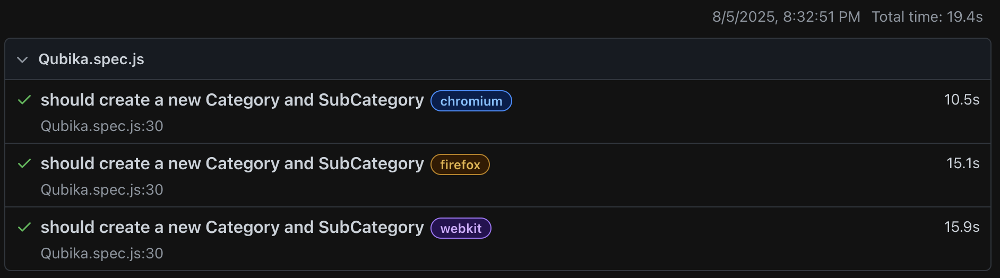
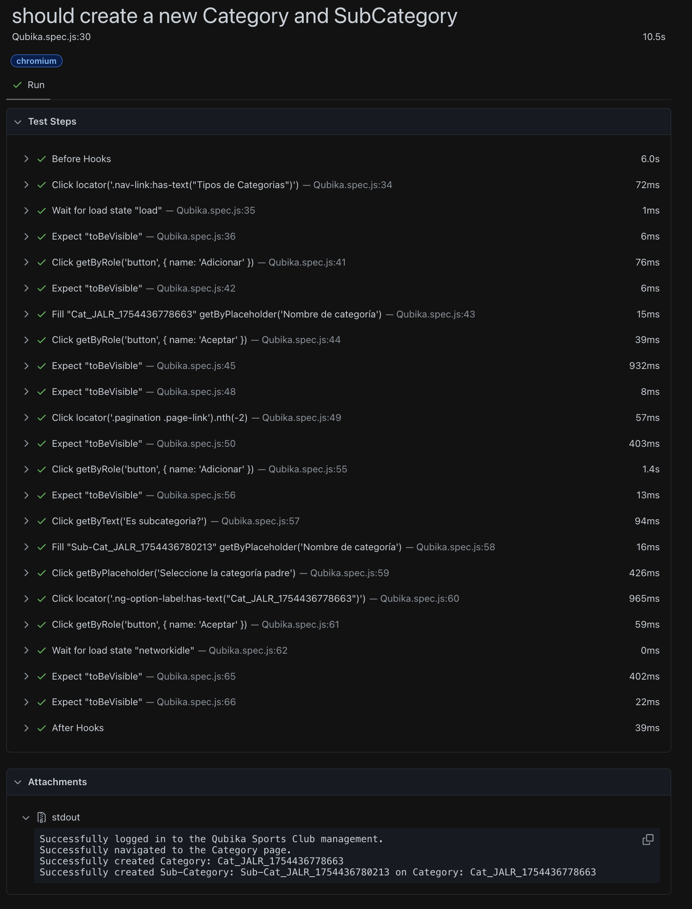

# Qubika Technical Challenge - QA Automation


This repository contains the solution for the **Qubika QA Technical Challenge**, which automates an e2e flow where a Category and a Sub-Category is created on Qubika Sports Club management website.


## Table of Contents

- [Introduction](#introduction)
- [Project Setup](#Project)
- [Dependancies and Configuration](#Dependancies)
- [How to Run the Tests](#How]
- [Test Implementation](#Test)
- [Additional Observations (Bugs)](#Additional)


## Introduction

This project addresses the Qubika Technical Challenge, focusing on automating a specific workflow on the Qubika Sports Club management website. The solution leverages Playwright with JavaScript to perform an end-to-end (e2e) test, covering both UI interactions and considerations for API integration. The test suite is designed to execute across multiple browsers, including Chromium and Firefox, as per the challenge requirements.

### The automated workflow includes the following steps:

1. Attempt to create a new user through API and save the user information.

2. Navigate to the Qubika Sports Club Management System login page.

3. Validate that the login page is displayed correctly, including necessary UI elements.

4. Log in with the created or existing test user.

5. Validate that the user is successfully logged in to the system.

6. Once logged in:
  1. Go to the Category page.
  2. Create a new category and validate its successful creation.
  3. Create a sub-category and validate it is displayed in the Categories list, correctly associated with its parent.

## Project Setup

The project was set up using Playwright Test with JavaScript to fulfill the requirements of the automation challenge.

### System Requirements
  _ Node.js: The project requires a Node.js **version of 20, 22, or 24.**

  _ Verification: To check your Node.js version, run in your terminal:
  ~~~
    node --version
  ~~~

  _If Node.js isn't installed, you can run the following command to install it using Homebrew (on macOS):
  ~~~
    /bin/bash -c "$(curl -fsSL https://raw.githubusercontent.com/Homebrew/install/HEAD/install.sh)"
  ~~~
### Playwright Installation
The project was initialized using the ```npm init playwright@latest``` command. During installation, Playwright browsers (Chromium, Firefox, WebKit) were installed to meet the multi-browser execution requirement.

## Dependencies and Configuration

### Installing Dependencies
To run the tests correctly, the **dotenv** package is required for environment variable management. From the project's root, execute the following command in your terminal:
  ```
  npm install dotenv
  ```

### Setting Up Environment Variables
Create a file named **.env** in the root of the project and add the following variables for the test credentials. <ins>This file is excluded from version control via .gitignore for security.</ins>

  ```
  - Application URLs
  BASE_URL=https://club-administration.qa.qubika.com

  - Test User Credentials
  TEST_EMAIL=test.qubika@qubika.com
  TEST_PASSWORD=12345678
  ```

## How to Run the Tests
Once the dependencies are installed and the environment variables are configured, you can run the tests with the command:
  ```
  npx playwright test
  ```

<ins>This command will run the tests in all three configured browsers.</ins>

## Test Implementation
The automation solution focuses on a complete end-to-end UI flow to:

1. Log in with the provided user.

2. Navigate to the Categories page.

3. Create a main category with a unique name.

4. Create a sub-category, correctly associating it with the main category.

5. Validate the successful creation of both categories in the UI.

### Adaptation for User Creation API:
The initial requirement included creating a new user through the API. However, during testing, it was found that the provided test user (test.qubika@qubika.com) does not possess the necessary permissions to create new users via the /api/users endpoint (specifically, the /api/auth/register endpoint resulted in a 401 Unauthorized error). Therefore, the test was adapted to proceed with logging in using the existing, valid test user for the UI flow, demonstrating problem-solving and adaptability in automation strategy.

# Expected Test Execution Output:
Upon successful execution, the console output will indicate that all 3 tests have passed across Chromium, Firefox, and WebKit, confirming the end-to-end flow works as expected in a multi-browser environment. An example of a successful run output is:

~~~
192:Playwright user$ npx playwright test tests/Qubika.spec.js
[dotenv@17.2.1] injecting env (3) from .env -- tip: 🛠️  run anywhere with `dotenvx run -- yourcommand`

Running 3 tests using 3 workers
[dotenv@17.2.1] injecting env (0) from .env -- tip: 🔐 prevent committing .env to code: https://dotenvx.com/precommit
[dotenv@17.2.1] injecting env (0) from .env -- tip: 📡 observe env with Radar: https://dotenvx.com/radar
[dotenv@17.2.1] injecting env (0) from .env -- tip: ⚙️  load multiple .env files with { path: ['.env.local', '.env'] }
[chromium] › tests/Qubika.spec.js:30:1 › should create a new Category and SubCategory
Successfully logged in to the Qubika Sports Club management.
Successfully navigated to the Category page.
Successfully created Category: Cat_JALR_1754436778663
[webkit] › tests/Qubika.spec.js:30:1 › should create a new Category and SubCategory
Successfully logged in to the Qubika Sports Club management.
Successfully navigated to the Category page.
[chromium] › tests/Qubika.spec.js:30:1 › should create a new Category and SubCategory
Successfully created Sub-Category: Sub-Cat_JALR_1754436780213 on Category: Cat_JALR_1754436778663
[firefox] › tests/Qubika.spec.js:30:1 › should create a new Category and SubCategory
Successfully logged in to the Qubika Sports Club management.
Successfully navigated to the Category page.
[webkit] › tests/Qubika.spec.js:30:1 › should create a new Category and SubCategory
Successfully created Category: Cat_JALR_1754436783185
[firefox] › tests/Qubika.spec.js:30:1 › should create a new Category and SubCategory
Successfully created Category: Cat_JALR_1754436784124
[webkit] › tests/Qubika.spec.js:30:1 › should create a new Category and SubCategory
Successfully created Sub-Category: Sub-Cat_JALR_1754436785223 on Category: Cat_JALR_1754436783185
[firefox] › tests/Qubika.spec.js:30:1 › should create a new Category and SubCategory
Successfully created Sub-Category: Sub-Cat_JALR_1754436786536 on Category: Cat_JALR_1754436784124
  3 passed (19.4s)

~~~






## Additional Observations
During the test execution and dedicated exploratory testing, several observations and potential issues were identified. A detailed report of these findings, including descriptions, impact, and severity, can be found in the Exploratory Testing Report file. [Exploratory Testing Report](ExploratoryTestingReport.md)


_These findings fulfill the requirements of the exploratory testing exercise by identifying non-functional bugs that could be missed during manual testing._


